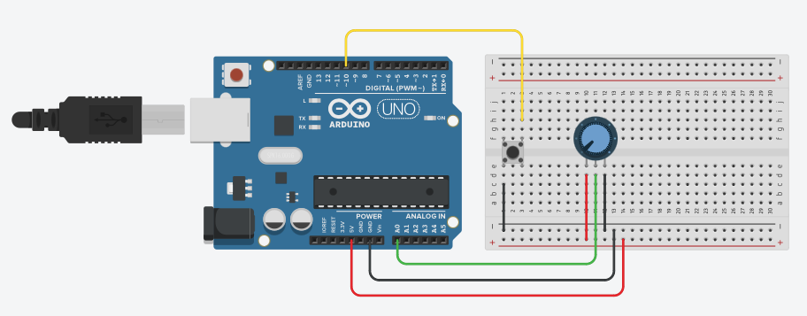

# ardunio-mkr-sample

Sample project for the [Arduino MKR 1500 NB]() board and the Span service. 

This sample uses the following circuit:

The potentiometer's middle pin is connected to A0 and the microswitch is connected to pin 10 on the Arduino. Remember to connect the pin to the 3v3 pin and not the 5V pin on the Arduino MKR since it uses 3.3V logic.